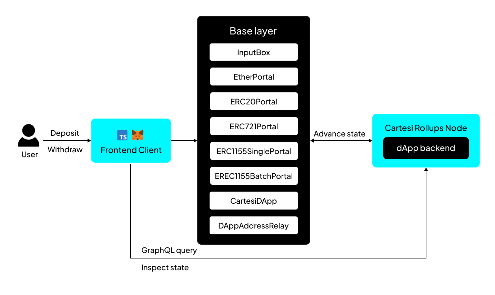

Assets exist on the base layer, where they have actual meaning and value.

As with any execution layer solution, a Cartesi dApp that wants to manipulate assets needs a secure way of "teleporting" the assets from the base layer to the execution layer and then a way to "teleport" them back to the base layer.

Currently, Cartesi Rollups support the following types of assets:

- [Ether (ETH)](../api/json-rpc/portals/EtherPortal.md)
- [ERC-20](../api/json-rpc/portals/ERC20Portal.md)
- [ERC-721](../api/json-rpc/portals/ERC721Portal.md)
- [ERC-1155 Single](../api/json-rpc/portals/ERC1155SinglePortal.md)
- [ERC-1155 Batch](../api/json-rpc/portals/ERC1155BatchPortal.md)

The Portal contracts, part of the on-chain components, are responsible for teleporting assets from the base layer blockchain to a Cartesi dApp. You can think of a Portal as a bank account owned by the off-chain machine.


Once deposited, those L1 assets gain a representation in the execution layer and are owned, there, by whomever the depositor assigned them to. 

When an asset is deposited, the corresponding Portal contract sends an input via the [`InputBox`](../api/json-rpc/input-box.md) contract, describing the type of asset, amount, receivers, and some data the depositor might want the dApp to read. This allows deposits and instructions to be sent as a single base layer interaction.

Anyone can deposit assets there but only the dApp — through the [`Application`](../api/json-rpc/application.md) contract — can decide on withdrawals. An input is sent requesting a withdrawal, which gets processed and interpreted off-chain. If everything is correct, the machine creates a voucher destined to the appropriate Portal contract, ordering and finalizing that withdrawal request. 




<!-- ## Deposits

Deposits are made by sending assets to the Portal contracts. The Portal contracts are responsible for teleporting assets from the base layer blockchain to a Cartesi dApp.


```shell
$ sunodo send
Select send sub-command:
❯ Send ERC-20 deposit to the application.
  Send ERC-721 deposit to the application.
  Send ether deposit to the application.
```

## Withdrawals

Before you make a withdrawal request to your dApp, the first thing to do is call a function in the `DAppAddressRelay` contract that allows you to inform the off-chain machine of the address of the dApp contract in a trustless and permissionless way.

Without relaying the address of your dApp, the withdrawal request will fail, and a voucher creation will fail.

You can do this relay call which simply adds the dApp address as an input via a custom frontend, sunodo, or Cast.

Using the most convenient approach, Sunodo, here is how you can relay the address of your dApp.

```shell
$ sunodo send
? Select send sub-command (Use arrow keys)
❯ Send DApp address input to the application.
```

Withdrawal requests can now be made. It is important to note that adding vouchers(making withdrawal requests) does not conclude the asset transfer.

These vouchers must be executed using the [`executeVoucher()`](../api/json-rpc/application.md/#executevoucher) function from the [`Application`](../api/json-rpc/application.md) contract. -->
