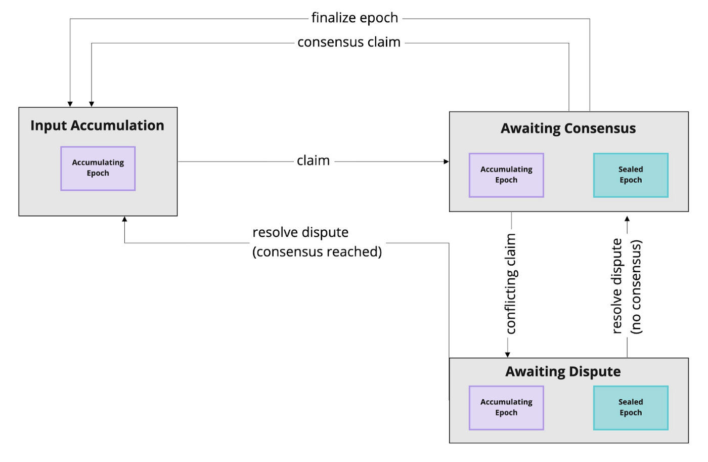
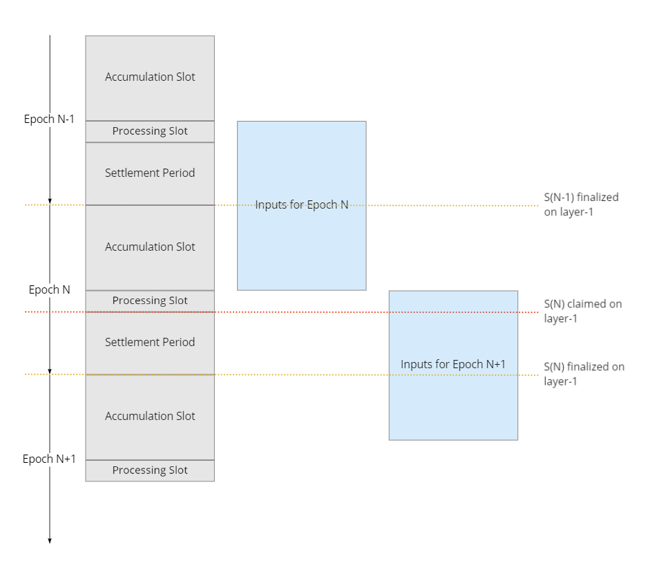
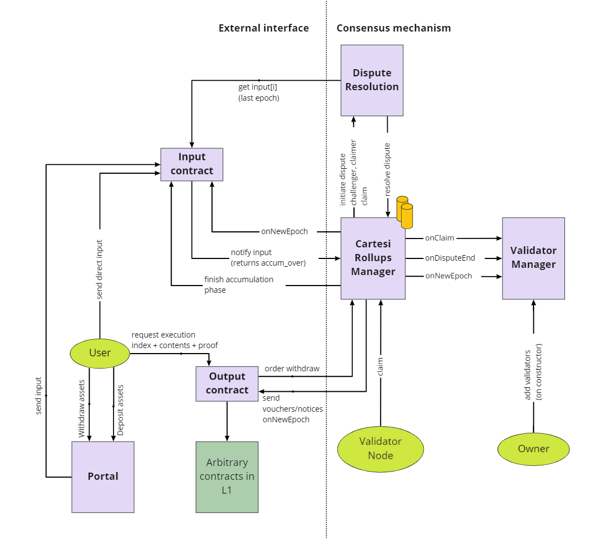
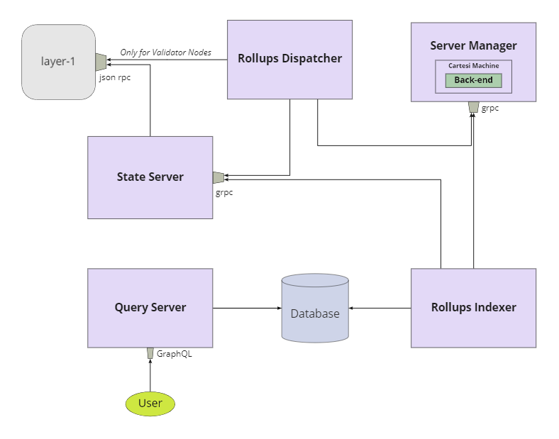

As explained in the [previous section](../cartesi-rollups/overview), the Cartesi Rollups framework achieves scalability by moving the bulk of the computation outside the blockchain, using the ledger as a data source but not as an execution environment. As such, the solution contains both on-chain (layer-1) and off-chain (layer-2) components.

:::note
In this section, we describe the internal components of the Cartesi Rollups framework in more detail, to clarify how the system works inside. DApp developers may chose to skip directly to the [DApp architecture](../cartesi-rollups/dapp-architecture) section to understand how to build applications.
:::

## Main concepts

### Cartesi Nodes

As explained before, [Cartesi Machines](../machine/overview) provide DApp developers with an environment in which large scale verifiable computations can be executed. These machines are integrated with the on-chain smart contracts by a _middleware_ that manages and controls the communication between them. As such, this middleware is responsible for first reading data from the layer-1 smart contracts, then sending them to the machine to be processed, and finally publishing their results back to the blockchain.

The _Cartesi Node_ is the layer-2 component that consists of the combination of the Cartesi Machine and this middleware, and can be used by anyone interested in the rollups state of affairs. Put simply, Cartesi Nodes play a role that is similar to what Geth does on the Ethereum ecosystem: execution and retrieval of information.

In practice, there are two distinct kinds of agents that run Cartesi Nodes: _users_ and _validators_. Each of them interacts with the on-chain rollups in different ways, and thus run different types of Cartesi Nodes:

* **User or Reader Nodes** are only involved in advancing the state of the off-chain machine. They consume information from the blockchain but do not bother to enforce state updates, trusting that validators will ensure the validity of all on-chain state updates.
* **Validator Nodes**, on the other hand, have more responsibility: they not only watch the blockchain but also fight possible dishonest validators to ensure the prevalence of honest claims for state updates.

### Epochs

In order to avoid over interacting with the blockchain, validators don't checkpoint every new state update on the off-chain machine. They do it at the end of an _epoch_, which are batched inputs that follow the same cycle.
We can imagine epochs in three different states:

- **Accumulating**, when the epoch is open and waiting for inputs.
- **Sealed**, when the inputs for that epoch are well defined and the validators are preparing to or sending their claims. Sealed epochs can also be under dispute.
- **Finalized**, when consensus was reached and the outputs can be safely executed.

The on-chain state, depending on the phase it is at, can contain one or two epochs, as illustrated by the diagram below.

- **Input Accumulation**: there is a single accumulating epoch, active and waiting for the inputs it is going to batch.
- **Awaiting Consensus**: there are two epochs. A sealed one, for which validators are preparing to or sending their claims, and an accumulating one, which is active and receiving inputs.
- **Awaiting Dispute**: also has two epochs. A sealed one and an accumulating one. The sealed epoch is under dispute. Two conflicting claims were received and the validators are enrolling in a verification game to decide which claim stands. Since the sealed epoch's inputs are well defined, honest validators will always reach the same claim. A dispute necessarily means that a claim is provably false.

To better understand the whole process on a timeline, let's describe how the system schedules different rollups phases.

On a given epoch N, the involved validator nodes batch all the input messages that were enqueued on-chain from the beginning of the previous _epoch’s processing_ slot until the beginning of the current epoch’s _processing slot_.

The nodes then process every message of the batch through the Cartesi Machine, producing an output hash that summarizes the state transition of the entire epoch. Then, one of the validators, henceforth called _claimer_, places on-chain the hash representing the layer-2 contract state at the end of epoch N, _S(N)_.

After a challenge period is over, if there was no dispute, _S(N)_ is assumed final by the system. Otherwise, disputes will follow until the correct state claim represented by its output hash is enforced. The _settlement period_ displayed on the diagram above accounts for a _challenge period_, with or without disputes.

To guarantee a minimum duration for each epoch, the rollups protocol also requires an _accumulation slot_. This is a minimal latency imposed on on-chain finalization to prevent frequent claims being sent to layer-1, for the sake of Ethereum fee cost-effectiveness. The rollup developer can configure a specific accumulation slot period for his application, to accommodate eventual specific requirements for balancing latency to finality and security.

### Vouchers

A _voucher_ is a combination of a target address and a payload in bytes. It is used by the off-chain machine to respond and interact with layer-1 smart contracts. When vouchers get executed they'll simply send a message to the target address with the payload as a parameter. Therefore, vouchers can be anything ranging from providing liquidity in a DeFi protocol to withdrawing funds from the [Portal](#portal). Vouchers can only be executed when the epoch in which they are contained is _finalized_, at which point a _validity proof_ will be available to ensure layer-1 smart contracts can trust its content.

### Notices

A _notice_ is an arbitrary payload in bytes that is submitted by the off-chain machine for informational purposes. Similarly to vouchers, when the epoch containing a notice is finalized a proof will be produced so that the validity of the notice's content can be verified on-chain by any interested party.

## On-chain components

These consist of the Cartesi Rollups smart contracts that were designed to mediate the relationship of the off-chain components with other smart contracts and externally owned accounts. They include several modules, each with clear responsibilities and well-defined interfaces.

### Cartesi Rollups Manager

The [Cartesi Rollups Manager](https://github.com/cartesi/rollups/blob/main/onchain/rollups/contracts/interfaces/IRollups.sol) is responsible for synchronicity between the modules. It defines the duration of the different phases and notifies the other modules of any phase change. Among others, the responsibilities of this module are:

- Define for which epoch, depending on the current state and deadlines, an input is destined to.
- Receive and forward claims to the Validator Manager.
- Forward disputes to the Dispute Resolution module.
- Forward the result of disputes to the Validator Manager.
- Forward the summary of finalized outputs (vouchers and notices) to the Output module.
- Notify other modules of phase changes.

### Input contract

As discussed above, the on-chain contracts often have two concurrent epochs: a sealed but unfinalized epoch, and an accumulating one. The [Input contract](https://github.com/cartesi/rollups/blob/main/onchain/rollups/contracts/interfaces/IInput.sol) keeps one inbox for each of those epochs, switching between them depending on the Cartesi Rollups Manager's notifications.

For anyone to be able to synchronize the machine from its beginning without needing to trust a data provider, the full content of inputs is always present in calldata on the blockchain. In on-chain storage, which needs to be used in a more parsimonious way, we keep a single hash for each input of an active epoch.
This input hash summarizes both the input itself and its metadata, which corresponds to the sender's address and the time of reception. Notice that this input implementation is permissionless: the permission layer is delegated to the off-chain machine which will, for example, judge if a sender is allowed to do what their input wants to do.

### Output contract

Each input can generate a number of notices and vouchers that will have an accompanying _validity proof_ available once the epoch containing them is finalized. These proofs can be used with the [Output contract](https://github.com/cartesi/rollups/blob/main/onchain/rollups/contracts/interfaces/IOutput.sol) to execute vouchers or verify the validity of a notice's content.

For vouchers, while the Output contract is indifferent to their content, it does enforce some sanity checks before allowing their execution, since vouchers are unique and can only be successfully executed once. Vouchers are executed asynchronously and don't require an access check, and the order of execution is not enforced. As long as vouchers are contained in a finalized epoch and were not executed before, the contract will allow their execution by anyone.

### Portal

The Portal, as the name suggests, is used to teleport assets from the Ethereum blockchain to DApps running on Cartesi Rollups. Once deposited, those layer-1 assets gain a representation in layer-2 and are owned, there, by whomever the depositor assigned them to. After being teleported, layer-2 assets can be moved around in a significantly cheaper way, using simple inputs that are understood by the Linux logic.

When an asset is deposited, the Portal contract sends an input to the DApp’s inbox, describing the type of asset, amount, receivers, and some data the depositor might want the DApp to read. This allows deposits and instructions to be sent as a single layer-1 interaction. One could think of the Portal as a bank account, owned by the off-chain machine.

Anyone can deposit assets there but only the DApp — through its Output contract — can decide on withdrawals. The withdrawal process is quite simple from a user perspective. They send an input requesting a withdrawal, which gets processed and interpreted off-chain. If everything is correct, the machine creates a voucher destined to the Portal contract, ordering and finalizing that withdrawal request. Currently, we support the following types of assets:

- [Ether (ETH)](https://github.com/cartesi/rollups/blob/main/onchain/rollups/contracts/interfaces/IEtherPortal.sol)
- [ERC-20](https://github.com/cartesi/rollups/blob/main/onchain/rollups/contracts/interfaces/IERC20Portal.sol)
- [ERC-721 (NFTs)](https://github.com/cartesi/rollups/blob/main/onchain/rollups/contracts/interfaces/IERC721Portal.sol)

### Validator Manager

The [Validator Manager](https://github.com/cartesi/rollups/blob/main/onchain/rollups/contracts/interfaces/IValidatorManager.sol) module was created to help DApps manage their claims, claim permissions, and punishments for bad behavior. Initially, our suggested implementation for this module includes the following characteristics: the set of payable validators is defined in construction time, validators send a claim for every epoch and those that lose a dispute are kicked off the validators set.

The [Cartesi Rollups Manager](#cartesi-rollups-manager) receives claims and redirects them to the Validator Manager. When receiving a claim, the Validator Manager checks which other claims have arrived at that epoch and returns the information that Cartesi Rollups Manager needs to continue. The module can respond to received claims in one of the following ways:

- If the sender is not a validator or the claim is invalid, the transaction reverts.
- If the claim is valid, doesn’t disagree with any of the other claims in the epoch, and does not generate consensus, it returns a "No Conflict" response.
- If the claim is valid but disagrees with another claim for that epoch, it warns the Cartesi Rollups Manager that a conflict is happening and what are the conflicting claims and claimants involved. When that dispute is resolved the Validator Manager module gets notified so it can deal however it likes with the validators involved. In our initially suggested implementation, the loser of a dispute gets removed from the validator set.
- If the claim is valid, agrees with all other claims in that epoch, and is the last claim to be received, it lets Cartesi Rollups know that consensus was reached. This allows the rollups DApp to finalize the epoch and allow for the execution of its vouchers. Regardless of what the name might suggest, validators do not interact with this module at all.

### Fee Manager and Bank

The [Fee Manager facet](https://github.com/cartesi/rollups/blob/main/onchain/rollups/contracts/interfaces/IFeeManager.sol) and [Bank contract](https://github.com/cartesi/rollups/blob/main/onchain/rollups/contracts/IBank.sol) aim to create an economical incentive for validators to run a given DApp. When you develop an application, you will need to define two parameters:
* A fee to be paid to the validators each time they submit a claim. This fee will be debited from the funds stored in the DApp's Bank contract.
* An owner for the Fee Manager facet, who has the option to change the fee value, if needed.

Entities running validator nodes should configure them to either be *altruistic* or require a minimum retainer (i.e., a minimum fee to process inputs for the DApp). If they are altruistic, they will work regardless of any financial compensation. On the other hand, non-altruistic validators must ensure that the following two conditions are met before processing inputs and submitting claims:
1. The fee paid by the DApp must be bigger than their required retainer
2. The DApp's Bank must have enough funds to pay the validator

The fee value is given in CTSI and is reserved for a validator every time a claim is made. The validator is free to withdraw received CTSI fees at any time of its convenience. While the Fee Manager controls the fee value and the amount of claims made by each validator, the Bank stores - on a separate contract - the CTSI tokens that will be distributed to them.

The code does not enforce a way for the Bank to be funded. Therefore, DApps and communities are free to choose their preferred procedures, such as direct transfer, charging per input, creating a tax system on top of the Portal, or other methods. For convenience, a *FundBank* hardhat task is provided which transfers money from the signer to a DApp's Bank.

### Dispute Resolution

Disputes occur when two validators claim different state updates to the same epoch. Because of the deterministic nature of our virtual machine and the fact that the inputs that constitute an epoch are agreed upon beforehand, conflicting claims imply dishonest behavior. When a conflict occurs, the module that mediates the interactions between both validators is the Dispute Resolution contract.

The code for rollups dispute resolution is not being published yet - but a big part of it is available on the Cartesi Rollups SDK, using the [Arbitration dlib](https://github.com/cartesi/arbitration-dlib/).

## Off-chain components

These consist of the internal modules of the [Cartesi Node](#cartesi-node). As explained before, Cartesi Nodes form the network that sustains the Cartesi Rollups solution, being responsible for executing the computations that arrive and presenting their results to the interested parties.

### State Server

This service is responsible for ensuring that the remaining modules have access to a consistent view of the state of the blockchain. The service is an instance of  Cartesi's [State Fold tool](https://github.com/cartesi/state-fold) and monitors all relevant activity from the Cartesi Rollups smart contracts, consolidating the information that gets emitted by the blockchain.

### Rollups Dispatcher

Responsible for interpreting the current state of the Cartesi Rollups smart contracts, this module informs the [Server Manager](#server-manager) about any incoming inputs and, in the case of Validator Nodes, also submits transactions corresponding to  state update claims. It will also handle any disputes should they arise.

### Server Manager

This module manages the Cartesi Machine, sending inputs to it and reading the produced outputs. It is responsible for starting and stopping the machine as appropriate, as well as providing an API for the other modules to query the machine's state.

The [**Host Server Manager**](https://github.com/cartesi/host-server-manager) is an alternative implementation of the Server Manager for development purposes. It implements the same API and mimics the behavior of an actual Server Manager, but does not in fact instantiate a Cartesi Machine. Instead, it makes HTTP requests directly to a DApp running in the host computer. The Host Server Manager is intended to be used in the [implementation stage of the DApp Life Cycle](../cartesi-rollups/dapp-life-cycle#stage-3-implementation).

### Rollups Indexer

This service is responsible for consolidating the state of the Cartesi Node. It queries blockchain information from the [State Server](#state-server) as well as data produced by the DApp back-end through the [Server Manager](#server-manager), consolidating everything in a local database.

### Query Server

Module that provides an externally accessible [GraphQL API](https://github.com/cartesi/rollups/blob/main/reader/src/graphql/typeDefs/typeDefs.graphql) for querying the consolidated state of the Cartesi Node, as maintained by the [Rollups Indexer](#rollups-indexer). This allows users and client applications to retrieve vouchers, notices and reports produced by the DApp back-end.
