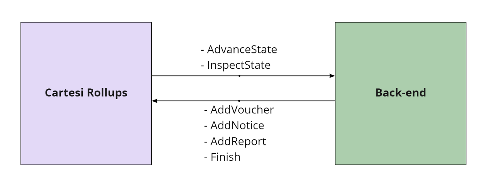

In a Cartesi DApp, the front-end and back-end parts of the application [communicate with each other through the Rollups framework](../cartesi-rollups/dapp-architecture#communication). This is accomplished in practice by using an HTTP API.

When designing the API for this communication with the framework, we wanted to ensure developers could create their applications without having to worry too much about the idiosyncrasies of blockchain technology or our rollups solution. In particular, we wanted to allow the back-end code to abstract away whether it was running inside a specific virtual machine or not.

With this in mind, we decided to offer an HTTP API as a convenience layer for this communication, leveraging a well-known and ubiquitous standard instead of having applications deal with any kernel-level or VM-specific devices, or having to understand how our rollups solution encodes and decodes data.

## Back-end API

The DApp's back-end needs to implement a couple of endpoints to receive requests from the Cartesi Rollups framework. These are specified by Cartesi's [DApp HTTP API](https://github.com/cartesi/openapi-interfaces/blob/master/dapp.yaml).

As the back-end processes the inputs received, it can access a second set of HTTP endpoints provided by the Rollups framework itself, in order to inform it of the computed results and consequences. These are defined by the [Dispatcher HTTP API](https://github.com/cartesi/openapi-interfaces/blob/master/dispatcher.yaml).

From the back-end component’s point of view, the API can be split into two parts, as illustrated by the figure below:

First, a couple of endpoints are expected to be implemented by the DApp’s back-end to receive requests from the Rollups framework, as shown in the list below:

* **AdvanceState** — Provides input to the back-end, to be processed asynchronously to advance the application’s state.
* **InspectState** — Submits a query about the current application state, to be answered synchronously.

As the back-end processes the inputs received via the *AdvanceState* endpoint, it can access a second set of HTTP endpoints provided by the Rollups framework itself, in order to inform it of the computed results and consequences, as shown below:

* **AddVoucher** — Called to specify a collateral effect in the form of a transaction that can be carried out on layer-1 (e.g., a transfer of ERC-20 tokens).
* **AddNotice** — Informs about a new relevant state of the application (e.g., updated player rankings).
* **AddReport** — Provides diagnostics or logs associated with a received input.
* **Finish** — Communicates that the asynchronous processing of an AdvanceState request has been completed.

:::note
Find the complete OpenAPI specification for these endpoints in <ins>**[Cartesi’s public Github repository](https://github.com/cartesi/openapi-interfaces)**</ins>.
:::

## Front-end API

The front-end part of the DApp needs to access the Cartesi Rollups framework to submit user inputs and retrieve the corresponding vouchers and notices produced by the back-end. The following figure and table detail how this communication is done:

* **AddInput** — Submits input data to the [Rollups smart contracts](https://github.com/cartesi/rollups/blob/main/contracts/Input.sol#L22) on layer-1 as a regular [JSON-RPC blockchain transaction](https://ethereum.org/en/developers/docs/apis/json-rpc/). When that transaction is mined and executed, an event is emitted containing the submitted input’s identifier, which the front-end can later use to query associated outputs. In the future, there will also be support for sending inputs via an aggregator service.
* **QueryOutputs** — Submits a query to a layer-2 node to retrieve vouchers, notices and reports, as specified by the [Cartesi Rollups GraphQL schema](https://github.com/cartesi/rollups/blob/main/src/reader/src/graphql/typeDefs/typeDefs.graphql).
* **InspectState** — Submits a query to a layer-2 node to retrieve arbitrary DApp-specific application state. Note that this endpoint is not yet available at the time of writing.
* **ExecuteVoucher** — Submits a JSON-RPC blockchain transaction to request a given voucher to be executed by the [Rollups smart contracts](https://github.com/cartesi/rollups/blob/main/contracts/Output.sol#L44) on layer-1. This is how a DApp’s results, such as a transfer of assets, can take effect on the underlying blockchain. It should be noted that the contracts will only actually execute the voucher if it has been finalized, meaning that its contents can no longer be disputed. Finalization is explained in more detail in the [Cartesi Rollups Components section](../cartesi-rollups/components#epochs) and in the [Rollups On-Chain article](https://medium.com/cartesi/rollups-on-chain-d749744a9cb3).
